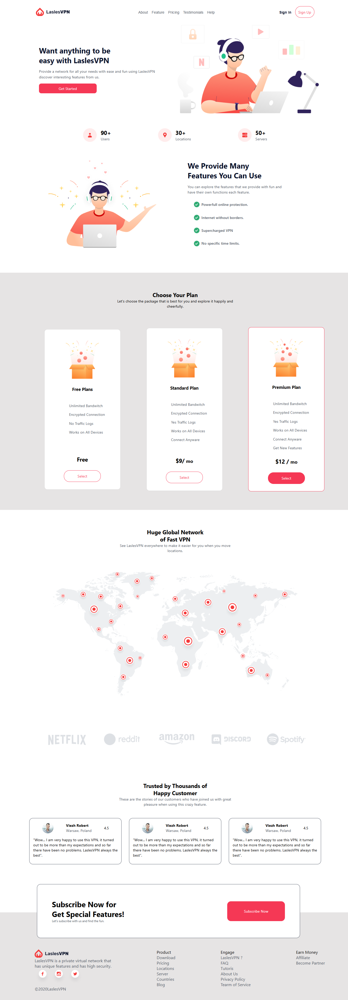

markdown
Copy
Edit

# LaslesVPN

LaslesVPN is a React-based VPN service landing page project with clean structure, modular components, and styling using CSS modules.

## Features

- **Modular Components:** Reusable React components with scoped CSS modules.
- **Responsive Design:** Works well on desktop and mobile devices.
- **Clean File Structure:** Organized for easy maintenance.
- **ESLint Configured:** Ensures consistent code style and quality.

---

## Technologies Used

- **React.js:** For building the user interface.
- **Vite:** For fast builds and hot module replacement.
- **CSS Modules:** For scoped and maintainable styles.
- **ESLint:** For linting and code quality.

---

## How to Run the Project

Follow these steps to run the project locally:

### 1. Clone the Repository

```bash
git clone <your-repo-url>
```

### 2. Navigate to the Project Directory

```bash
cd LaslesVPN
```

### 3. Install Dependencies

Make sure you have Node.js installed, then run:

```bash
npm install
```

### 4. Start the Development Server

```bash
npm run dev
```

The application will be available at http://localhost:3000 (or the port shown in your terminal).

---

Folder Structure

```
LaslesVPN/
├── node_modules/              # Project dependencies
├── public/                    # Static public assets
├── src/                       # Source files
│   ├── assets/                # Images, icons, and other static files
│   ├── Componets/             # React components with their CSS modules
│   │   ├── Feedback.jsx
│   │   ├── Feedback.module.css
│   │   ├── Footer.jsx
│   │   ├── Footer.module.css
│   │   ├── Header.jsx
│   │   ├── Header.module.css
│   │   ├── Hero.jsx
│   │   ├── Hero.module.css
│   │   ├── Network.jsx
│   │   ├── Network.module.css
│   │   ├── Plans.jsx
│   │   ├── Plans.module.css
│   ├── App.css                # Global styles for App
│   ├── App.jsx                # Main app component
│   ├── index.css              # Base styles
│   ├── main.jsx               # React DOM render entry point
├── .gitignore                 # Git ignore rules
├── eslint.config.js           # ESLint configuration
├── index.html                 # Main HTML file
├── package-lock.json          # Auto-generated lock file for npm dependencies
├── package.json               # Project metadata and dependencies
```

---

Contributing
Contributions are welcome! Feel free to fork the repository and submit a pull request.

License
This project is open-source and available under the MIT License.

Happy Coding! 🚀

Screen Layout

### 1. Home Page



---
